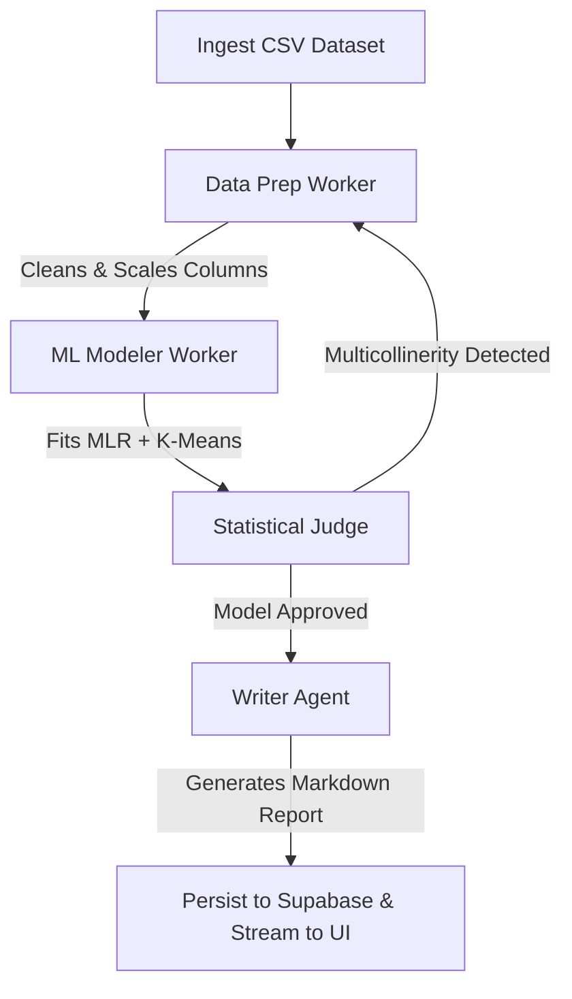

# Auto-Analyst AI: Multi-Agent Data Science Workspace

Auto-Analyst AI is a SaaS-grade multi-agent workspace designed for automated data science analysis, regression, clustering, and insights reporting. 

The application utilizes a **FastAPI backend** running sandboxed code execution loops, integrates with the **Google GenAI SDK (Gemini 2.5 Flash)** for code construction, and is backed by a **Supabase database** for persistent state logs. It includes two frontend options: a live-connected **React + Vite WebSockets interface** and a high-fidelity **Next.js dark-mode dashboard**.

---

## 1. Project Architecture

The codebase is split into three main components:

*   **`backend/`**: FastAPI server hosting WebSocket connection routes, the sandboxed Python execution engine (interfacing with `matplotlib` for plot extraction), agent prompts, and dual-mode database schemas.
*   **`frontend/`**: Responsive React + Vite application featuring real-time log streams, interactive agent trees, and a light/dark theme toggle built using Google Stitch UI design tokens.
*   **`next-app/`**: High-fidelity enterprise dashboard built with Next.js 16 and Tailwind CSS v4, containing a collapsible markdown results panel, terminal logs simulator, and tab routing.

---

## 2. Multi-Agent Pipeline Loop



1.  **Data Prep Agent**: Analyzes metadata and creates a script to impute missing fields and scale numerical variables using `StandardScaler`.
2.  **ML Modeler Agent**: Constructs a script to fit Multiple Linear Regression and K-Means models, checks pairwise feature correlations, saves metrics to JSON, and prints plots.
3.  **Statistical Judge Agent**: Audits outputs. If $R^2 < 0.50$ or collinearity is detected ($r > 0.70$), it sets approval to `False`, identifies collinear features, and triggers a self-correction pass.
4.  **Writer Agent**: Translates mathematical model coefficients and segments into an executive, actionable business report in Markdown.

---

## 3. Configuration Setup

### Environment File (`.env`)
Create a `.env` file in the root workspace folder with the following variables:

```env
# Google AI Studio API Key (Defaults to gemini-2.5-flash)
GEMINI_API_KEY=your_gemini_api_key_here
GEMINI_MODEL=gemini-2.5-flash

# Supabase Configurations (Optional - defaults to local SQLite fallback if empty)
SUPABASE_URL=https://your-project-id.supabase.co
SUPABASE_KEY=your_anon_public_key_here
```

### Database Tables (Supabase SQL Editor)
Execute the following schema script in your Supabase SQL Editor:

```sql
-- 1. Create Datasets Table
CREATE TABLE datasets (
    id UUID PRIMARY KEY,
    created_at TIMESTAMP WITH TIME ZONE DEFAULT timezone('utc'::text, now()) NOT NULL,
    file_name TEXT NOT NULL,
    row_count INTEGER NOT NULL,
    columns_json JSONB NOT NULL
);

-- 2. Create Pipeline Runs Table
CREATE TABLE pipeline_runs (
    id UUID PRIMARY KEY,
    dataset_id UUID REFERENCES datasets(id) ON DELETE CASCADE,
    created_at TIMESTAMP WITH TIME ZONE DEFAULT timezone('utc'::text, now()) NOT NULL,
    run_status TEXT NOT NULL, -- 'pending', 'cleaning', 'modeling', 'validating', 'completed', 'failed'
    final_metrics JSONB
);

-- 3. Create Agent Logs Table (Audits)
CREATE TABLE agent_logs (
    id UUID PRIMARY KEY,
    run_id UUID REFERENCES pipeline_runs(id) ON DELETE CASCADE,
    created_at TIMESTAMP WITH TIME ZONE DEFAULT timezone('utc'::text, now()) NOT NULL,
    agent_name TEXT NOT NULL, -- 'data_prep', 'ml_modeler', 'statistical_judge', 'writer'
    raw_prompt TEXT NOT NULL,
    model_response TEXT NOT NULL,
    execution_code_used TEXT
);

-- 4. Disable Row Level Security (RLS) for Development
ALTER TABLE datasets DISABLE ROW LEVEL SECURITY;
ALTER TABLE pipeline_runs DISABLE ROW LEVEL SECURITY;
ALTER TABLE agent_logs DISABLE ROW LEVEL SECURITY;
```

---

## 4. Running the Workspace

All components run independently out-of-the-box:

### Step 1: Start the FastAPI Backend
Launch the server in the `backend` folder:
```bash
cd backend
uv run uvicorn app.main:app --host 127.0.0.1 --port 8000
```
*(The backend binds to port `8000`. You can inspect documentation at `http://127.0.0.1:8000/docs`).*

### Step 2: Start the Live React Frontend (Vite)
Launch the dev server in the `frontend` folder:
```bash
cd frontend
npm install
npm run dev -- --host 127.0.0.1
```
*(Available in your browser at `http://127.0.0.1:5173/`).*

### Step 3: Start the Next.js Dashboard
Launch the dashboard dev server in the `next-app` folder:
```bash
cd next-app
npm install
npx next dev -p 3010
```
*(Available in your browser at `http://localhost:3010/`).*

---

## 5. Development Verification
To test the backend connection, API endpoints, and model capabilities directly from your console, run the pre-configured backend verification script:
```bash
uv run backend\test_backend.py
```
This script creates a dummy sales dataset, registers it in your active database, calls the Gemini model to write code, executes the code in a sandbox, validates results, and prints the generated report.
